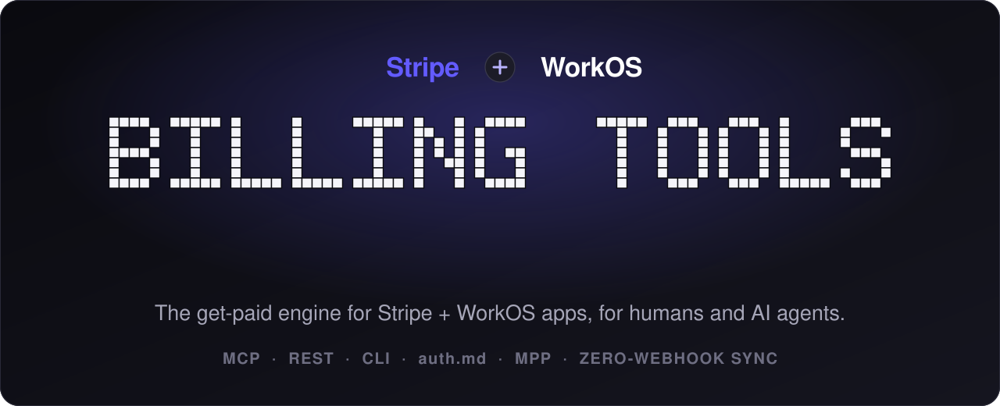

<p align="center">
  
</p>

<p align="center">
  <b>Drop-in auth + billing for any Stripe&nbsp;+&nbsp;WorkOS app, usable by humans <i>and</i> AI agents,</b><br/>
  exposed as <b>MCP tools</b>, a <b>REST API</b>, and a <b>CLI</b>, over one storage-agnostic engine.
</p>

<p align="center">
  
  
  
  
  
  
  
</p>

---

**Billing Tools** packages the "get money in" plumbing you'd otherwise rebuild in every SaaS: API-key auth on top of **WorkOS**, token/credit + subscription billing on top of **Stripe**, and (because the next wave of customers is autonomous) first-class **agent** rails: [`auth.md`](https://workos.com/auth-md) self-registration and [`MPP`](https://mpp.dev/) machine payments. Wire it once; serve humans through a browser and agents through headless HTTP with the same engine. Storage is pluggable behind one small adapter (use the built-in WorkOS store, or mirror into your own Postgres).

## Table of contents

- [Ship tools, not billing plumbing](#ship-tools-not-billing-plumbing)
- [Key Features](#key-features)
- [Getting Started](#getting-started)
- [How it works](#how-it-works)
- [Agent auth (auth.md)](#agent-auth-authmd)
- [Machine payments (MPP)](#machine-payments-mpp)
- [CLI](#cli)
- [Configuration](#configuration)
- [Roadmap](#roadmap)
- [Contributing](#contributing)
- [License](#license)

## Ship tools, not billing plumbing

The next generation of software is **agents**, and an agent is only as useful as the **tools** it can call. Tools *are* the product now.

But you don't go to war naked. Ship a tool into the wild with no auth and no way to get paid, and you're just donating GPU time to strangers. Someone still has to meter every call, hold a balance, bill the workspace, enforce seats, and cut off the freeloaders: the boring, identical, get-it-wrong-once-and-bleed-money layer that *every* AI product rebuilds from scratch.

**Billing Tools is the armor.** Bring a Stripe + WorkOS stack and you inherit, out of the box, the exact monetization model the frontier labs run on. The same shape as **Anthropic, OpenAI, and xAI (Grok)**:

- 💰 **A price per token:** every tool call costs tokens, metered and deducted automatically.
- 🏢 **Workspaces:** the billable account, with one Stripe customer + balance each.
- 👥 **Users per workspace:** seats, invitations, and roles.
- 🪙 **Tokens per user:** per-seat grants, seat limits, and auto-reload.

So you do the one thing only you can do (**build great tools**) and monetize them the same afternoon. The get-paid layer is already handled, battle-tested, and agent-ready. 🛡️

## Key Features

### 🔐 Auth & identity
- 🔑 **API-key auth:** WorkOS organization API keys (`Authorization: Bearer sk_…`), validated on every request.
- ✉️ **Passwordless magic-auth:** email a 6-digit code, get back a workspace/org + API key. No passwords.
- 🤖 **auth.md agent self-registration:** the [WorkOS auth.md](https://workos.com/auth-md) protocol (RFC 9728 Protected-Resource-Metadata + RFC 8414 Authorization-Server-Metadata + `/agent/identity` anonymous or verified-email + the claim ceremony), so agents onboard with **no human signup**.
- ♻️ **RFC 7009 revocation:** revoke a key by value; always-200, no token-existence leak.
- 🎫 **Optional OAuth-JWT hook:** bring your own MCP OAuth proxy via a single adapter method.

### 💳 Billing & payments
- 🪙 **Usage-metered token wallet:** held in the native Stripe customer credit balance (1 token = 1¢), with idempotent credit/debit.
- 🛒 **Checkout top-ups:** Stripe Checkout that auto-offers cards **+ Apple&nbsp;Pay / Google&nbsp;Pay / Link**.
- 📦 **Declarative subscription plans:** describe plans in code; products/prices are **auto-provisioned in Stripe** via `lookup_key` (immutable-price safe, orphan-cleaning). Zero dashboard clicks.
- 🎟️ **Per-seat / per-cycle token grants + seat limits:** included tokens scale with active members.
- 🔁 **Auto-reload:** off-session saved-card recharge when the balance drops below a threshold.
- 🧾 **Invoices + 🏛️ Customer Portal:** list invoices, and a one-call Stripe Billing Portal URL for self-serve upgrade/downgrade/cancel + card updates.
- 🔒 **Idempotency on every money move:** welcome bonus, checkout credit, and per-cycle grants each carry a stable key, so retries/replays never double-charge.

### 🤖 Built for AI agents
- 📄 **auth.md:** the [agent onboarding standard](https://workos.com/auth-md), served for you (`/auth.md` narrative + discovery metadata).
- 🏧 **MPP machine payments:** Stripe's [Machine Payments Protocol](https://mpp.dev/): a HTTP **402 + `WWW-Authenticate: Payment`** challenge for pay-per-request (SPT card or crypto/USDC), the payment sibling of auth.md's 401.
- 🧰 **MCP server tools:** `get_api_key`, `get_token_balance`, `buy_tokens`, `list_plans`, `get_billing_portal`, and more, drop straight into Claude, Cursor, or any MCP client.
- 🧭 **Discovery hints:** every 401/402 advertises `resource_metadata`, so an agent can bootstrap unattended.

### 🧩 Three surfaces, one engine
- 🛠️ **MCP:** `createMcpTransport({ register, adapter })`.
- 🌐 **REST:** `createToolListHandler` + `createToolDispatchHandler` (429/401/400/404 mapping built in).
- ⌨️ **CLI:** `registerBillingCommands(program, …)` gives you `auth`, `keys`, `balance`, `buy`, `invoices`.
- 🪝 **Stripe webhook:** `createStripeWebhookHandler()` for instant checkout crediting.

### 🔄 Zero-webhook sync
- 📡 **Event polling:** reconcile Stripe **and** WorkOS via their Events APIs. No webhook endpoints, no signing secrets.
- ⏱️ **Any scheduler:** run it in-process with `sync.start()` (persistent hosts) or as a serverless cron via `createSyncRoute()`.
- 🪞 **Generic DB mirror:** shadow WorkOS orgs/users into your own tables (`createMirror`), driver-agnostic.
- 📉 **Dunning hook:** `invoice.payment_failed` flips the org to `past_due` and fires an `onPaymentFailed` hook (Stripe Smart Retries do the retries).

### 🌍 Framework and platform agnostic
- ⚡ **Web-standard handlers:** everything returns `Request` to `Response`; mount in Next.js, Hono, Bun, Deno, or Cloudflare Workers.
- 🧱 **No framework imports:** runtime deps are just `stripe` + `@workos-inc/node`.
- 🗄️ **Bring your own DB:** no `pg` dependency; you pass a `query` executor (any Postgres-compatible driver).
- 🔌 **Pluggable storage adapter:** WorkOS-only, or WorkOS + your DB mirror, behind one interface.
- ☁️ **No lock-in:** runs on any Node host (Railway / Render / Fly / Vercel / self-host).

### 🏛️ Design doctrine
- 📐 **SDK-first:** thin-wraps the Stripe & WorkOS SDKs (SDK types, pagination, typed errors, idempotency) so the lib evolves *with* the platforms instead of drifting.
- 🎯 **One memoized client per SDK:** lazy, never constructed at import.
- 🔒 **Secure by default:** AES-256-GCM session encryption at rest, SHA-256-hashed claim tokens, verified-domain-only internal-org checks.
- 🧪 **Offline-testable:** the auth.md + MPP protocol surfaces are pure `Request` to `Response`, unit-testable without a live account.

## Getting Started

### Prerequisites
- **Node 18+**
- A **Stripe** secret key (`STRIPE_SECRET_KEY`)
- A **WorkOS** API key + client id (`WORKOS_API_KEY`, `WORKOS_CLIENT_ID`)

### Install

Installed as a Git dependency (ships compiled `dist/`, so **no build step or `transpilePackages`** in the consumer). Pin by commit SHA for reproducibility:

```jsonc
// package.json
"dependencies": {
  "@arnaudjnn/billing-tools": "github:arnaudjnn/billing-tools#<commit-sha>"
}
```

> To upgrade later, run `pnpm update @arnaudjnn/billing-tools` and commit the lockfile. Prefer a commit SHA over a tag: package managers cache the Git tag-to-SHA resolution and can serve a stale commit.

### Environment

```bash
STRIPE_SECRET_KEY=sk_test_…
STRIPE_WEBHOOK_SECRET=whsec_…        # only if you mount the webhook
WORKOS_API_KEY=sk_…
WORKOS_CLIENT_ID=client_…
INTERNAL_ORG_DOMAINS=acme.com        # optional: orgs with these verified domains are unmetered
```

### Wire it up (Next.js example)

```ts
// billing.ts, one composition root (single module instance = one auth context)
import {
  registerBillingTools, createDispatcher, resolveConfig,
  createToolListHandler, createToolDispatchHandler,
  createMcpTransport, createStripeWebhookHandler,
} from "@arnaudjnn/billing-tools";
import { WorkOSOrgAdapter } from "@arnaudjnn/billing-tools/adapters/workos-org";

export const adapter = new WorkOSOrgAdapter();            // WorkOS is the source of truth
const config = resolveConfig({ currency: "usd", baseUrl: process.env.APP_URL! });

const register = (server: any) => registerBillingTools(server, { adapter, config });
const dispatcher = createDispatcher(register);

export const mcp          = createMcpTransport({ register, adapter });        // app/[transport]/route.ts
export const toolList     = createToolListHandler({ dispatcher });            // app/api/v0/route.ts
export const toolDispatch = createToolDispatchHandler({ dispatcher });        // app/api/v0/[tool]/route.ts
export const webhook      = createStripeWebhookHandler();                     // app/api/stripe/webhook/route.ts
```

```ts
// app/[transport]/route.ts
import { mcp } from "@/billing";
export const GET = mcp.GET;
export const POST = mcp.POST;
```

### First call

```bash
# List available tools + costs
curl https://your-app.com/api/v0

# Use a key (Bearer sk_…)
curl -X POST https://your-app.com/api/v0/get_token_balance \
  -H "Authorization: Bearer sk_…"
```

Add agent onboarding with [`createAgentAuth`](#agent-auth-authmd) and pay-per-call with [`createMachinePaymentHandler`](#machine-payments-mpp). See below.

## How it works

**WorkOS is always the source of truth.** Your app's `orgId` is opaque: implement the adapter and everything (auth, metering, Stripe math, all surfaces) works unchanged. Two shipped patterns:

| Pattern | What `orgId` maps to | Storage | Use when |
|---|---|---|---|
| **A: WorkOS-only** | the WorkOS org id | none beyond WorkOS | you don't have (or need) your own DB rows |
| **B: WorkOS + DB mirror** | your own id (e.g. `ws_…`) | a `workos_org_id` column + `org.externalId`, 1:1 | you keep local rows and mirror WorkOS into them |

In both, API keys are WorkOS org keys and the Stripe pointer lives on the org. The `WorkOSOrgAdapter` (`@arnaudjnn/billing-tools/adapters/workos-org`) implements both; pass a `map` for Pattern B.

## Agent auth (auth.md)

Implements the [WorkOS auth.md](https://workos.com/auth-md) spec.

```ts
import { createAgentAuth } from "@arnaudjnn/billing-tools";

export const agentAuth = createAgentAuth({
  adapter, config,
  branding: { productName: "Acme", logoUri: "https://acme.com/logo.svg" },
  identityTypes: ["anonymous", "verified_email"],
});
// mount: /auth.md, /.well-known/oauth-{protected-resource,authorization-server},
//        /agent/identity, /agent/identity/claim, /oauth/token, /oauth/revoke
```

An agent hits a 401, follows the `resource_metadata` hint to your metadata, reads `/auth.md`, then registers (either **anonymously** for an instant key, or via a **verified-email** claim ceremony where the user reads back a code) and starts calling tools. All handlers are `Request` to `Response`.

## Machine payments (MPP)

Implements Stripe's [Machine Payments Protocol](https://mpp.dev/).

```ts
import { createMachinePaymentHandler } from "@arnaudjnn/billing-tools";

const pay = createMachinePaymentHandler({ methods: ["stripe"], amount: 50, currency: "usd" });
const gate = await pay.requirePayment(request);
if (gate instanceof Response) return gate;   // 402 + WWW-Authenticate: Payment challenge
// else settlement succeeded, serve the paid resource
```

The 402 challenge + credential parsing ship ready and are offline-testable. Actual settlement (card via shared payment tokens, or crypto/USDC) is injected via a `settle` function once your Stripe account is enabled for machine payments; until then the gate returns a clean "settlement not enabled" 402 (never a crash). `createPaymentMd()` serves an agent-facing `/payment.md`.

## CLI

```ts
import { registerBillingCommands } from "@arnaudjnn/billing-tools";
import { Command } from "commander";

const program = new Command();
registerBillingCommands(program, { configDir: "~/.acme", envPrefix: "ACME", defaultUrl: "https://acme.com" });
// acme auth | keys list|revoke | balance | buy | invoices
```

## Configuration

`BillingConfig` (pass to `resolveConfig`):

| Field | Default | Purpose |
|---|---|---|
| `baseUrl` | required | Checkout success/cancel + portal return URLs |
| `currency` | `"usd"` | Stripe currency |
| `freeTokens` | `100` | Welcome credit on first customer creation |
| `internalDomains` | `[]` | Orgs with these **verified** WorkOS domains are unmetered (see `internalDomainsFromEnv`) |

## Roadmap

- 🧰 `createBilling()` one-call composition helper (mount every surface from a single config)
- 🧾 Stripe Tax (`automatic_tax`) opt-in
- 🪙 x402 machine-payment protocol alongside [MPP](https://mpp.dev/)

## Contributing

Issues and PRs welcome. The engine is plain TypeScript compiled with `tsc`; `dist/` is committed (consumers install via Git). See `AGENTS.md` for the architecture, the adapter interface, the SDK-first doctrine, and the release flow.

## License

[MIT](LICENSE) © Arnaud Jeannin
